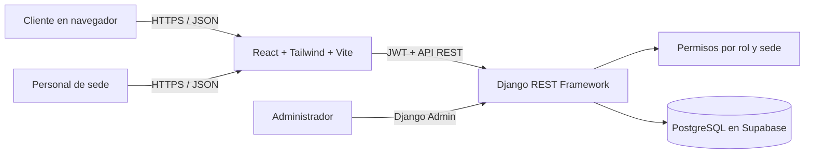
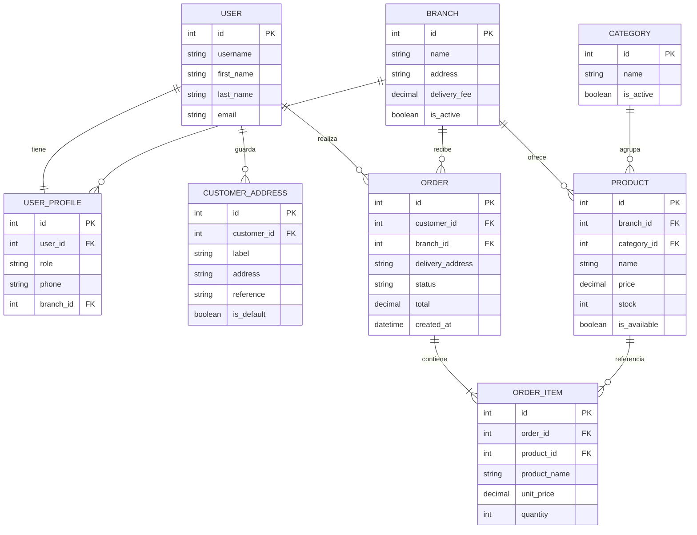

# Arquitectura y modelo inicial

## Arquitectura

La web React + Tailwind obtiene datos del API REST de Django. Django aplica autenticación JWT, permisos por rol, reglas de creación de pedidos y acceso a datos. PostgreSQL de Supabase guarda los datos; la URL de conexión se configura en `.env` y el backend no la expone al navegador.

## Entidades principales

### Reglas que implementa esta versión

- La cuenta pública siempre se crea como cliente; el cliente no puede asignarse roles internos desde el formulario.
- El personal se asocia a una sede en su perfil. Cocina, operadores y repartidores consultan los pedidos de esa sede.
- El administrador puede consultar pedidos de todas las sedes.
- Al crear un pedido, el servidor vuelve a validar la disponibilidad y el inventario, guarda precio/nombre históricos de cada ítem y descuenta existencias dentro de una transacción.
- El total se calcula en el servidor como subtotal más tarifa de domicilio configurada en la sede.
- El cliente puede cancelar su propio pedido mientras sigue en estado recibido; la operación repone las existencias en la misma transacción.
- Los cambios de estado se validan en el servidor y dependen del rol.
- El menú público omite productos inactivos o sin existencias.

## Rutas de API y permisos

| Ruta | Rol | Función |
|---|---|---|
| `POST /api/auth/register/` | Público | Registro de cliente |
| `POST /api/auth/token/` | Público | Access y refresh JWT |
| `GET /api/me/` | Autenticado | Perfil propio |
| `GET, POST /api/addresses/` | Autenticado | Consulta o guarda direcciones del usuario actual |
| `GET, PATCH, DELETE /api/addresses/{id}/` | Autenticado | Edita o elimina solo una dirección propia |
| `GET /api/customers/?search=...` | Operador/admin | Busca clientes activos para registrar pedidos asistidos |
| `GET /api/branches/` | Público | Sedes activas |
| `GET /api/categories/` | Público | Categorías activas |
| `GET /api/products/` | Público | Menú disponible; filtra por sede, categoría o texto |
| `GET /api/orders/` | Autenticado | Pedidos propios o pedidos de la sede/rol |
| `POST /api/orders/` | Cliente, operador o admin | Crea pedido con productos de una sola sede; operador/admin indica el cliente |
| `POST /api/orders/{id}/cancel/` | Cliente propietario | Cancela antes de preparación y repone existencias |
| `PATCH /api/orders/{id}/status/` | Personal autorizado | Avanza el pedido con transiciones válidas |

## Decisiones a revisar con el profesor

- Si la sede debe asignarse al producto (modelo simplificado actual) o mediante una relación de disponibilidad para compartir un mismo producto entre sedes.
- Cuándo se reserva o descuenta stock; ahora se descuenta al confirmar el pedido.
- Si el operador puede cancelar pedidos durante preparación; la API permite que el operador o cocina los cancele y debe confirmarse esa regla con el profesor.
- Si los repartidores deben poder ver el teléfono del cliente y qué datos personales deben ocultarse.
- Si la tarifa de domicilio será fija por sede o diferenciada por zonas.
